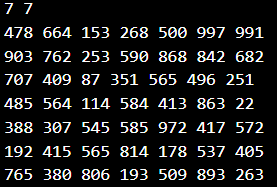
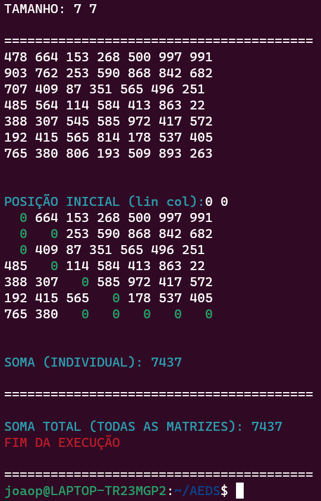

<head><h1 align="middle"><i><u>Algoritimo Guloso</u></i></h1></head>
<h1>Introdução e Objetivos📃</h1>
  
Esse Algoritimo efetua um caminhamento de uma matriz de forma gulosa (greedy Algorithm). O caminhamento se dá 
    através da escolha do maior número que está a volta da posição atual como sua próxima posição.Com objetivo final de chegar 
    a extrema diagonal inferior direita de uma determinada matriz. As entradas deste algoritimo são matrizes de inteiros 
    do arquivo input.data localizado na pasta dataset. Ao fim do caminhamento de uma matriz, é imprimido na tela a soma total  
    de todas as posições que foram "caminhadas" nesta matriz, podendo, assim prosseguir para a proxima matriz.
    <h3>Objetivos alcançados 📌</h3>
    <ul>
      <li><strong>-[✔️]Leitura e armazenamento das matrizes.</strong></li>
      <li><strong>-[✔️]Comparação e decisão da próxima posição na matriz.</strong></li>
      <li><strong>-[✔️]Impressão da soma total.</strong></li>
      <ul>
        <li>-Individual ➡️ Soma dos caminhos de uma só matriz que foi analisada.</li>
        <li>-Global ➡️ Soma dos caminho realizados por todas as matrizes analisadas.</li>
      </ul>
       
  

<h1>Lógica implementada 💡</h1>
  

    <h2><u>Inicialização e Atribuições de variaveis: </u></h2>  
    <li><strong>A função set_size tem como objetivo ler a primeria linha do arquivo "input.data", linha essa que informa o tamanho das matrizes subseguintes.Permitindo a alocação dinâmica da matriz.</strong></li>
    <li><strong>É perguntado logo após, na função set_stance, a posição inicial desejada pelo usuário.</strong></li>
    <ul><li>A atribuição da posição se dá através de um struct, armazenando a linha e a coluna, além do valor da determinada posição.</li></ul>
    <ul><li>-[❌]Não há o tramento caso o usuário digite uma posição inexistente na matriz</li></ul>
    <li><strong>Após a atribuição do tamanho da matriz e de sua posição inicial, ocorre o chamado da função joystick, que realizara o "caminhamento" na matriz.</strong></li>
    <strong><i>Parte localizada nas linhas 9 a 21 do arquivo main.c</i></strong>
     
    
     
    <h2><u>Caminhamento 🥾:</u></h2>  
    <li><strong>Tomando em conta que a posição inicial esta armazenda na váriavel "st" da struct "stance" , a analise para verificar 
    o maior número em volta começa á partir dos valores de i e j da variavel.</strong></li>
    <ul><li>-i ➡️ valor da linha</li><li>-j ➡️ valor da coluna</li></ul>
    <li><strong>Caso a posição atual seja na ultima linha, só resta andar para a direita até chegar ao destino 
    ignorando a regra de andar só para a posição que possui o maior número (linhas 41 a 51).
    </strong></li>
    <li><strong>Em caso de empate de valores o programa prioriza as seguintes direções</strong></li>
    <ul>
    <li>Diagona inferior direita↘️</li>
    <li>Direita➡️</li>
    <li>Diagonal inferior esquerda↙️</li>
    <li>Esquerda⬅️</li>
    <li>Baixo⬇️</li>
    </ul>
    <li><strong>Em casos que, ou a posição atual impossibilita de ir para a esquerda,ou impossibilita de ir para a direita; 
    há 2 condicionais que previnem o caminhamento para uma posição que não deveria ir (linhas 54 e 60).
    </strong></li>
    <li><strong>A cada nova posição os valores são acumulados para depois resultar na soma dos caminhos da matriz 
    após o caminhamento de uma matriz a soma é guardada em outra váriavel que é a soma global(todas as matrizes).
    </strong></li>
    
  

<h1>Exemplo de execução</h1>
  

    <i><strong>Arquivo de entrada do programa (uma matriz 7x7): </strong></i> 
     
    <i><strong>Saída do programa: </strong></i> 
    
    <li><i>O caminho andado é marcado pelo número 0, e logo abaixo da matriz é imprimida a soma do caminho da matriz. 
    Ao final da execução também é impresso na tela a soma global.</i>
    </li>
  

<h1>Arquivos</h1>
  

    <li><u>main.c</u>: Corpo do código.</li>
    <li><u>functions.c</u>: Implementação das funções.</li>
    <li><u>functions.h</u>: Declaração de funções e bibliotecas usadas.</li>
    <li><u>input.data</u>: Arquivo que possui as entradas do programa.</li>    
  

<h1>Instruções de Compilação e Execução</h1>
  

    <i>Este código possui um arquivo Makefile que facilita a compilação e execução do programa As diretrizes de execução deste
    Make file são:<i>
    <table border="1">
      <tr><td><u>make clean</u></td> <td>Apaga a última compilação realizada contida na pasta build</td></tr>
      <tr><td><u>make</u></td> <td>Executa a compilação do programa utilizando o gcc, e o resultado vai para a pasta build.</td></tr>
      <tr><td><u>make run</u></td> <td>Executa o programa da pasta build após o programa já estar compilado </td></tr>
    </table>
    <i>Para a execução do programa utilize <u>make</u> para realizar a compilação e logo após utilize <u>make run</u> para executar o programa</i>
  

